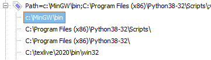

# C/C++编程vs code的配置

Windows下C/C++项目的开发，现在也能用vs code来做了。需要一点点基建。

1. Windows下GNU的安装依靠MinGW，在MinGW官网[下载](https://osdn.net/projects/mingw/downloads/68260/mingw-get-setup.exe/)并安装。注意不要修改缺省安装路径(路径名不能带空格)。


这时点mingw32-gcc-g++-bin之前的选择框，mark for installation。


然后点菜单Installation -> Apply Changes:


再于弹出的对话框里选择Apply:


安装完后关闭安装程序。

2. 需要将c:\MinGW\bin\加入系统环境变量path之中。这里采用我比较喜欢的Rapid Environment Editor(在这里[下载](https://www.rapidee.com/en/download))。注意右键其图标选用管理员身份运行，在PATH变量下增加一个值：c:\MinGW\bin\




保存退出：


3. 新建一个工作目录，然后在CMD字符界面下进入那个目录，运行命令"code ."，即用vscode打开那个目录，这是最常用的开始编程的工作方式。

4. 在目录下新建一个文件hello.c，内容如下：

```
#include<stdio.h>

void main(){
  printf("Hello World");
}
```

5. 在vs code里安装code runner extension：


6. 然后右键选择Run Code即可看到程序在Terminal窗口的输出：


上面就是完整的C/C++编程项目的基建介绍。有了这个基础知识，我们就可以做编程工作了。对于vscode下的调试，将在新一篇中介绍。
