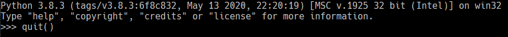
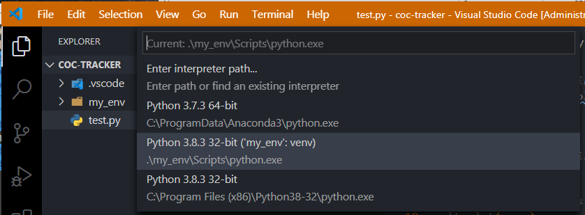
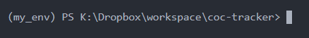
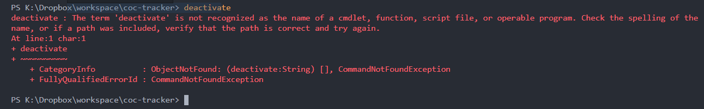
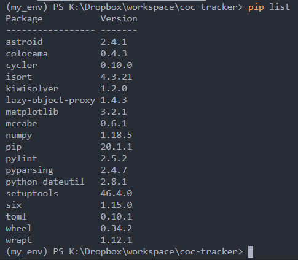
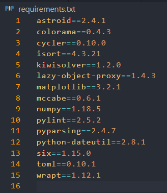
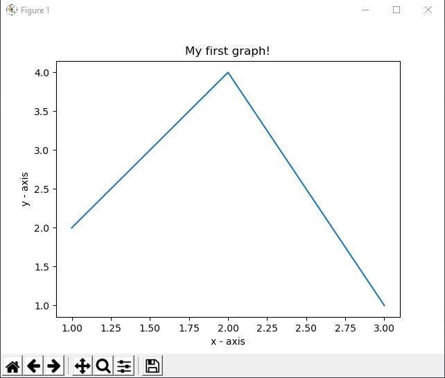

# Window下Python开发项目的基建

Windows下Python项目看起来不需要什么基建，但其实还是要的。这是因为Python环境跟Windows不是那么顺条，如果是Linux或者Mac就舒服一些。

1. python现在版本问题简化一点了，除非你接着做一个老项目，只能用python 2.X，否则，新手一律用python3。缺省安装是32位，一般不需要64位版本。

2. Windows下python的安装，是一个意外庞大的事情，有无数条注册表条目的更新。不要同时用python的官方安装程序和chocolatey等windows package manager重复安装python。只保留一个python安装。如果发现系统里有python2的安装或者以前的python3的安装，最好先卸载。最新的安装程序，一定要选择custom install，选择install for all users比较好，同时选择安装pip (pip是python的package manager tool)。在安装结束时，还有一个选项，选择disable path length limit，这是一个很惊艳的功能：windows下的路径长度有一个古老的限制，该限制会导致前端开发或者庞大的项目里出现路径过长超过该限制时文件系统出问题。Linux和Mac在这一点上很优越。而最新版Python安装程序可以修复Windows系统这一问题。

3. 安装好python以后，启动windows的CMD字符界面，输入python可以进入python命令行。输入quit()退出。注意：这样安装的python是无法在git bash字符界面下运行的。在powershell下可以。在vscode的terminal下可以。

   

4. 在CMD字符界面下输入pip命令，可以识别运行。说明pip已经装好。

5. 如果原来安装有vscode，重启以后可能会提示选择python解释器，则选择刚安装路径下的python解释器。可能还会提示安装pylint，选择安装即可。

6. Jetbrains的Pycharm虽然很省心，但是不免费。最好还是用vscode作为工作环境。关于vscode的安装设置，对于python来说，缺省的配置已经可以满足基本需要。

7. 新建一个工作目录，然后在CMD字符界面下进入那个目录，运行命令"code ."，即用vscode打开那个目录，这是最常用的开始编程的工作方式。

8. vscode下按Ctrl+Shift+`，打开新的Terminal窗口，输入命令安装virtualenv：

```
pip install virtualenv
```

9. 如果看到提示：

```
WARNING: You are using pip version 19.2.3, however version 20.1.1 is available.
You should consider upgrading via the 'python -m pip install --upgrade pip' command.
```

就按照提示输入上述命令升级pip。

10. 现在在当前空白目录下创建一个虚拟环境：

```
virtualenv my_env
```

创建好的一瞬间，vscode会提示你是否选择它，应该选择YES，然后，terminal提示符前就出现了虚拟环境名称：


这时候可以输入deactivate命令退出该虚拟环境。

如果你在vs code提示选择该虚拟环境的对话框时没有操作，可以手动选择：按下快捷键Ctrl+Shift+p，在出现的命令框里输入python switch interpreter：



可以看到，所谓切换虚拟环境，就是把vs code的python解释器interpreter选择为该虚拟环境下的python.exe。做这个切换就等于选择了该虚拟环境。但是注意，这么切换以后，你的vscode的terminal窗口里的提示符并没有显示出该虚拟环境，还是老样子：


这时候，你需要关掉该terminal窗口，办法是输入exit，而不是按右上角的X。然后，在菜单下选择新开一个Terminal窗口，这时候，提示符前就出现了虚拟环境名称：



只有在虚拟环境下才能输入deactivate命令退出该虚拟环境。如果不在虚拟环境下，输入deactivate命令，无法识别：



11. 为什么需要虚拟环境？

很直观的第一点，我们看到在vscode下切换虚拟环境，可以把当前项目的python解释器指向虚拟环境自带的python.exe，这样这个项目所使用的python版本就是独立于当前windows系统安装的python版本，从而使得你可以同时对好几个不同python版本项目编程，只需要对不同的vscode窗口切换到那个项目的虚拟环境。

第二点，是每个虚拟环境下，编写的python代码可能需要不同的pathon库包package。每个库包随时用pip install命令安装，也可以随时把当前虚拟环境下已经安装了的所有库包列一个清单，输出到一个reqiurements.txt文件里。这样，当你把项目代码开源，别人下载你的项目代码，也需要安装你这个虚拟环境下所需库包时，只需要一个命令，安装requirements.txt里清单列出的所有库包即可，不需要一个一个库包运行pip install命令。所以虚拟环境以及requirements.txt清单，使得项目配置安装非常方便和独立。

下面举例介绍怎么做：

首先选择好虚拟环境，然后在vscode编辑器里创建一个python文件，起名test.py，内容如下：

```
# importing the required module
import matplotlib.pyplot as plt

# x axis values
x = [1,2,3]
# corresponding y axis values
y = [2,4,1]

# plotting the points
plt.plot(x, y)

# naming the x axis
plt.xlabel('x - axis')
# naming the y axis
plt.ylabel('y - axis')

# giving a title to my graph
plt.title('My first graph!')

# function to show the plot
plt.show()
```

因为这段代码需要用到matplotlib库，在Terminal界面下安装它：

```
pip install matplotlib
```

安装完毕，现在我们列一下当前虚拟环境下已经安装的库：

```
pip list
```



现在我们用一个命令把这个清单写入requirements.txt：

```
pip freeze > requirements.txt
```

项目当前目录下自动生成该文件，可以在vscode下查看其内容。



当你拿到别人的项目，打开以后，用前面讲过的方式在vscode里选择python解释器进入其虚拟环境，需要从requirements.txt里安装所有库包时，运行：

```
pip install -r requirements.txt
```

然后再运行pip list命令，就可以看到文件中所列的库包都已经安装到当前虚拟环境里了。

上面就是完整的python虚拟环境基建介绍。有了这个基础知识，我们就可以做编程工作了。对上述例子来说，在Terminal下运行python test.py即可看到绘图结果：



vs code下python程序的debug，打算单独列一篇来介绍。